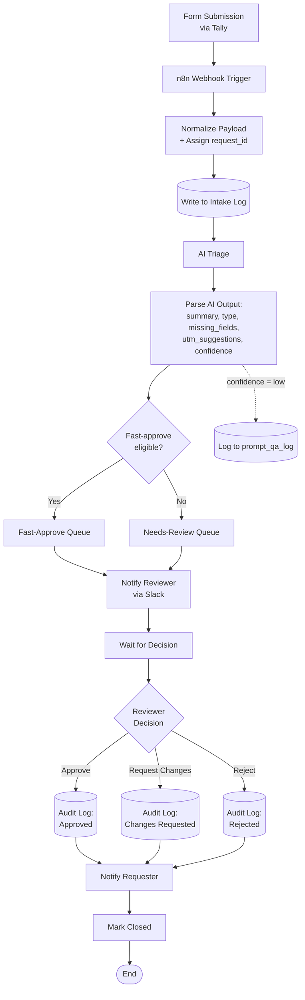

# AI-Powered MarOps Workflow in n8n

> A portfolio project demonstrating AI-assisted campaign intake validation with human-in-the-loop governance, structured audit logging, and prompt-quality monitoring. Built in n8n; both workflows execute live against real Google Sheets and Gmail; all three reviewer-decision branches verified end-to-end on 2026-05-06.

---

## 👉 Start here

**The 5-minute version of this project is the [case study](case_study_marops_ai_workflow.md)** — outcome-focused, evidence-based, and built around the same artifacts a hiring manager would ask to see. If you have 5 minutes, read that. If you have 15, the deeper engineering thinking lives in the [decision log](decision_log.md), the [failure-modes analysis](failure_modes.md), and the [build packet](n8n_build_packet.md).

---

## At a glance

- **Who this is for:** Marketing Operations, MarTech Operations, Revenue Operations, and Business Systems hiring managers evaluating candidates who can responsibly integrate AI into operational workflows.
- **What it demonstrates:** End-to-end systems thinking — planning, decision discipline, failure-mode analysis, AI governance controls, structured implementation, and reproducible documentation.
- **What it deliberately is not:** A production system. Every integration uses mock data, test workspaces, and project-owner test inboxes. The portfolio value is in the *thinking*, not in connecting to live customer data.
- **License:** [MIT](LICENSE) — the build packet, schemas, prompt template, decision log, failure-modes analysis, and workflow JSON exports are all deliberately public and free to copy, adapt, and ship. What you'd pay for in a real engagement is the customization to your specific MAP/CRM, reviewer protocols, UTM conventions, and compliance posture — none of which is in this generic template.

---

## Quick links for reviewers

- 📄 **[Case Study](case_study_marops_ai_workflow.md)** — outcome-focused 5-min read with smoke-test evidence
- 📋 **[Workflow Blueprint](workflow_blueprint.md)** — node-by-node architecture, schemas, AI prompt with grounding rules, routing logic
- 🛠️ **[n8n Build Packet](n8n_build_packet.md)** — implementation reference: every node's parameters, expressions, and connection topology
- 🧭 **[Decision Log](decision_log.md)** — 12 documented architectural decisions with options, rationale, and revisit clauses
- 🛡️ **[Failure Modes Analysis](failure_modes.md)** — 21 failure modes with detection/mitigation/recovery + 20-case adversarial test matrix
- 🤖 **[AI Prompt Templates](ai_prompt_templates.md)** — versioned prompts with grounding rules and example outputs
- 👤 **[Human Review Protocol](human_review_protocol.md)** — reviewer SOP and escalation paths
- 🐳 **[Local n8n Docker Setup](local_n8n_docker_setup.md)** — v2 Track A: self-host the workflow and activate the live Anthropic call
- 🟧 **[HubSpot v2 Extension Design](v2_hubspot_extension.md)** — v2 Track B: extend the architecture into HubSpot for legitimate MAP/CRM tech-stack credit

If you have 5 minutes, read the Case Study. If you have 15, read the Decision Log and Failure Modes — both tell you more about how I think than the workflow itself does.

---

## What this is

A campaign intake workflow that takes a marketing request — channel, audience, campaign name, UTMs, description — and uses AI to summarize, classify, validate, and propose corrections, then routes the request to a human reviewer. Every step is logged to an audit trail. Low-confidence AI outputs are routed to a separate prompt-quality log for periodic review.

The system is split into two n8n workflows by design:

1. **Intake workflow** — runs once per submission. Receives the form, normalizes the payload, calls the AI for triage, applies a mechanical hallucination check, routes to fast-approve or needs-review based on a three-condition eligibility rule, and notifies the reviewer in Slack. Ends.
2. **Decision poller** — runs every 5 minutes on a schedule. Picks up any intake row where the reviewer has set a `decision` value, writes the audit log, notifies the requester via email, and marks the request closed.

This split prevents long-running executions, simplifies error recovery, and matches how MarOps teams actually operate: intake is real-time; decisions are async.

---

## Why this matters

In most marketing organizations, campaign requests arrive through inconsistent channels — Slack DMs, email threads, ad-hoc spreadsheets — with inconsistent fields, incomplete UTM tracking, and no audit trail. This produces three measurable problems:

1. **Reporting gaps.** Missing or malformed UTMs corrupt downstream attribution data, obscuring true pipeline ROI.
2. **Reviewer overhead.** MarOps teams spend significant time chasing missing information instead of approving requests.
3. **Compliance risk.** Without an audit log, there is no record of who approved what, when, or why.

This workflow addresses all three by combining structured intake, AI-assisted triage, human review, and logged decisions.

---

## Architecture



Full node-by-node specification, schemas, and AI prompt are in [the workflow blueprint](workflow_blueprint.md).

---

## AI governance approach

The phrase "AI governance" gets thrown around a lot. Here's what it concretely means in this project:

1. **Structured JSON output, schema-validated.** The AI returns a fixed JSON shape with enum-constrained fields. Invalid output is treated as a parse failure, not silently passed through.
2. **Confidence ratings as first-class routing signals.** Fast-approve requires `confidence == "high"` AND no missing fields AND no UTM normalization needed. Confidence alone never bypasses review.
3. **Mechanical hallucination guard.** A post-AI check verifies that the summary references both `campaign_name` and `channel` from the original payload. If either is missing, confidence is forced to `low` regardless of what the AI returned.
4. **Synthesize-on-failure pattern.** AI errors (malformed JSON, timeout, provider downtime) do not crash the workflow. They construct a synthetic low-confidence record and route to needs-review with a flag, so the reviewer becomes the AI substitute.
5. **Three-tier logging.** The `audit_log` captures the workflow narrative. The `prompt_qa_log` captures every low-confidence AI output for periodic prompt-quality review. The `webhook_rejections` log captures inputs rejected at the gate.
6. **Versioned prompts.** Every AI call records the prompt version (`triage_v1.1`) in the audit log, so the prompt and its outputs are traceable across changes.

The design philosophy: **the human is the last line, not the only line.** Multiple controls fire before the reviewer gets involved.

---

## Tech stack

| Layer | Tool | Notes |
|-------|------|-------|
| Form | Tally | Free tier; native webhook |
| Orchestration | n8n | Cloud or self-hosted |
| AI | Claude | Single composite triage call returning structured JSON |
| Storage | Google Sheets | 4 sheets: `campaign_intake`, `audit_log`, `prompt_qa_log`, `webhook_rejections` |
| Reviewer notifications | Slack | Test workspace, single channel |
| Requester notifications | Gmail | Project owner test inbox |
| Versioning | GitHub | Markdown source of truth |

Each tool choice is documented in the [decision log](decision_log.md) with alternatives considered and rationale.

---

## Repository tour

```
ai-powered-marops-workflow/
├── README.md                              ← you are here
├── LICENSE                                ← MIT
├── case_study_marops_ai_workflow.md       ← 5-min portfolio narrative (start here)
├── case_study_marops_ai_workflow.docx     ← Word version for email/PDF
│
├── workflow_blueprint.md                  ← architecture spec
├── n8n_build_packet.md                    ← node-by-node implementation reference
├── decision_log.md                        ← 12 documented architectural decisions
├── failure_modes.md                       ← 21 FMs + 20-case adversarial test matrix
│
├── ai_prompt_templates.md                 ← versioned prompts with grounding rules
├── prompt_qa_log.md                       ← prompt-quality review process
├── human_review_protocol.md               ← reviewer SOP and escalation paths
│
├── campaign_intake_schema.csv             ← intake log schema
├── audit_log_schema.csv                   ← governance trail schema
├── prompt_qa_log_schema.csv               ← AI quality log schema
├── webhook_rejections_schema.csv          ← input-layer rejection log schema
├── sample_campaign_requests.csv           ← 12 test cases incl. adversarial
│
├── portfolio_workflow_plan.md             ← original phasing plan
├── n8n_workflow_draft.md                  ← Phase 4 implementation notes
│
├── local_n8n_docker_setup.md              ← v2 Track A: self-host n8n + activate live Anthropic
├── v2_hubspot_extension.md                ← v2 Track B: HubSpot Contact-enrichment design doc
├── screenshot_capture_checklist.md        ← capture spec for embedding visual evidence
├── MarOps_Intake_Workflow_1.json          ← Workflow 1 JSON export (importable into any n8n)
├── MarOps_Decision_Poller_Workflow_2.json ← Workflow 2 JSON export (importable into any n8n)
├── screenshots/                           ← embedded UI evidence (8 captures from live demo)
│
├── screen_recording_script.md             ← walkthrough storyboard for the Loom demo
└── resume_linkedin_assets.md              ← resume bullets, LinkedIn headline, post draft
```

---

## Mock vs real

| What's real | What's mock |
|-------------|-------------|
| The n8n workflow logic | The campaign requests (sample data) |
| The AI calls (real Claude API) | The reviewer (project owner role-playing MarOps) |
| The Google Sheets | The Slack workspace (test, single channel, single user) |
| The audit trail | The Gmail inbox (project owner test address) |
| The schemas, validations, and routing | Anything that would touch real customer data |

The boundary is intentional and is documented as the first decision in the project (`decision_log.md` DR-001). Connecting to live CRM, ad platforms, or production credentials would add zero portfolio value and create real risk.

---

## Project status

| Phase | Status | Output |
|-------|--------|--------|
| 1 — Concept and Architecture | ✅ Complete | 3 planning docs (~25KB) |
| 2 — Portfolio Design | ✅ Complete | Case study, narrative arc, evidence inventory |
| 3 — Build Artifacts | ✅ Complete | 5 schemas, 3 governance docs |
| 4 — n8n Implementation | ✅ Complete | Both workflows live, executable on demand |
| 5 — QA and Demo Testing | ✅ Complete (live smoke tests) | All 3 reviewer-decision branches verified end-to-end |
| 6 — Portfolio Packaging | ✅ Complete | Case study (`case_study_marops_ai_workflow.md`), screen recording script |
| 7 — Resume / LinkedIn / Interview Prep | ✅ Complete | `resume_linkedin_assets.md` with bullets, headline, project entry, post draft |

The phasing is itself a deliberate choice ([DR-002](decision_log.md)): plan in Chat, build artifacts in Code, execute in Co-Work. The cost of being wrong is lowest in planning and highest in execution, so the most thinking happens first.

---

## What's deliberately NOT in this project

These items are explicitly deferred to keep the project finishable. Knowing what to leave out is part of the portfolio signal.

- Two-way sync with a real CRM (HubSpot, Salesforce)
- Multi-language support
- Multi-tenant or multi-team routing logic
- Automated UTM application without human approval
- Reviewer SLA dashboards
- Slack interactive buttons (deferred to v1.5; v1 uses sheet-column polling)
- Periodic prompt-QA spot-check process (Phase 6+ stretch goal)
- Custom AI model fine-tuning (would be inappropriate for this scope)

The full out-of-scope list with rationale is in [the blueprint](workflow_blueprint.md#12-out-of-scope-v1).

---

## What's already built (and verified)

- ✅ Two n8n workflows (intake + decision poller), live and executable on demand
- ✅ Four populated Google Sheets tabs with real audit-log entries from end-to-end test runs
- ✅ A Tally form (id `A7WO5W`) wired to the intake webhook
- ✅ A Gmail credential dispatching real per-decision-template emails to a test inbox
- ✅ All three reviewer-decision branches (`approve`, `request_changes`, `reject`) smoke-tested with verifiable artifacts: structured audit-log rows + dispatched per-decision Gmail templates + status writebacks. See the case study for the results table.
- ✅ A portfolio case study capturing the build, the architectural-honesty incident (Anthropic egress), and the v2 roadmap.

**Outstanding for v2** (architecturally documented; not built):

- Real Anthropic Claude call replacing the deterministic JS mock_v1, once n8n is on a paid tier or self-hosted
- Auto-approve high-confidence path (`confidence=high` + no missing fields → 24-hour reviewer override window)
- Slack reviewer notifications via `#marops-intake-test`
- `prompt_qa_log` entries for medium/low-confidence triages
- Webhook honeypot for bot-submission rejection

---

## How to reproduce

A MarOps practitioner with an n8n instance, a Google account, an Anthropic API key, and a Tally account can recreate this system in roughly 90 minutes:

1. Create the four-tab Google Sheets workbook from `campaign_intake_schema.csv`, `audit_log_schema.csv`, `prompt_qa_log_schema.csv`, and `webhook_rejections_schema.csv`.
2. Build the Tally form following the field list in `workflow_blueprint.md` (13 fields mirroring the `campaign_intake` schema columns 3–15).
3. Open `n8n_build_packet.md` and follow it node by node — each node's parameters, expressions, credentials, and connection topology are specified.
4. Use `sample_campaign_requests.csv` for end-to-end smoke tests: TC-001 (happy path) is the recommended first run; TC-006/TC-008 exercise the medium/low-confidence paths; TC-017 is a prompt-injection probe.
5. The build packet's "Decisions and failure modes" section flags the known artifacts you might hit (e.g. duplicate-`request_id` collisions in `Sheets Update`).

If you hit the n8n cloud → `api.anthropic.com` egress block the way I did, the mock_v1 substitution pattern is documented in the case study under "The hard problem I had to solve."

---

## About

Built by Gregory Reinhart as part of an AI workflow certification and portfolio project. The project intentionally targets safe, resume-credible language and avoids inflated claims about machine learning, model training, or production deployment.

Career target areas: Marketing Operations, MarTech Operations, Revenue Operations, CRM Operations, Campaign Operations, Business Systems, AI-assisted workflow governance.

---

## Topics

`marketing-operations` `marops` `revops` `ai-workflow` `n8n` `claude` `ai-governance` `human-in-the-loop` `prompt-qa` `hallucination-detection` `campaign-intake` `utm-validation` `audit-logging` `failure-mode-analysis` `mock-data` `portfolio-project`
